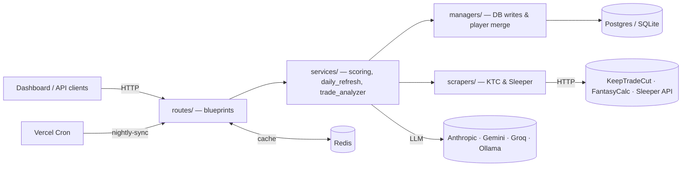

# Sleeper Backend API

A Flask + SQLAlchemy service that powers a fantasy-football dynasty dashboard. It
ingests data from **KeepTradeCut** and the **Sleeper API**, reproduces Sleeper's
scoring exactly for the entire player universe, serves a single cache-backed
bundle to the frontend, and runs an LLM-powered trade analyzer behind a unified
interface. Deployed serverlessly on Vercel with a scheduled nightly ingest.

- **Live docs (Swagger):** <https://sleeper-backend.vercel.app/docs>
- **Local docs:** <http://localhost:5001/docs> · OpenAPI at `/openapi.json`

## Features

- **Multi-source player valuations** — aggregates trade values from
  **KeepTradeCut**, **FantasyCalc**, and **Sleeper projections**, normalized
  across league format, scoring mode, and Tight-End-Premium tier, and merged onto
  Sleeper player identities.
- **League-accurate scoring** — reproduces Sleeper's matchup points for the entire
  player universe from raw stat lines and each league's scoring settings, not just
  rostered players.
- **Bundled dashboard API** — one Redis-cached endpoint returns a league's rosters,
  players, ownership, and season points; a companion endpoint exports the full
  player universe.
- **AI Trade Analyzer** — grades trades through a provider-agnostic layer
  (Anthropic, Google Gemini, Groq, Ollama) with structured output and per-client
  rate limiting.
- **Dynasty research** — ownership and start-percentage ingestion per season/week.
- **Async, rate-limited refresh** — long-running scrapes return immediately with a
  job id to poll; expensive refresh endpoints are throttled.
- **Scheduled nightly sync** — a single cron entrypoint refreshes valuations,
  leagues, research, and stats, then warms the cache — scoped to the current
  season since prior seasons are immutable.

## Architecture

A layered Flask app: HTTP routes delegate to services (orchestration), which use
managers (DB writes / merges) and scrapers (external fetchers). Redis caches the
read-heavy endpoints; Postgres (or SQLite locally) is the system of record.



Blueprints register through `routes/registry.py`; shared error/JSON envelopes
live in `routes/helpers.py`. See [`CLAUDE.md`](CLAUDE.md) for the full layer map
and domain conventions, and [API_DOCUMENTATION.md](API_DOCUMENTATION.md) for the
endpoint reference.

## Tech stack

- **API:** Flask 3, SQLAlchemy 2, Flask-Migrate (Alembic)
- **Data:** PostgreSQL (prod) / SQLite (local + tests), Redis (caching + rate limiting)
- **External:** KeepTradeCut (scraped), FantasyCalc, Sleeper API, LLM providers via official SDKs
- **Runtime:** Gunicorn, Docker Compose for local infra, Vercel serverless (`vercel_app.py`)
- **Tooling:** pytest, Swagger UI / OpenAPI

## Quick start

**Local (SQLite, no DB server):**

```bash
pip install -r requirements.txt
./startup.sh                       # http://localhost:5001
```

**Docker (Postgres + Redis + Flask):**

```bash
./docker-compose.sh up             # http://localhost:5001
```

Try it:

```bash
curl http://localhost:5001/api/ktc/health
curl -X POST "http://localhost:5001/api/ktc/refresh?league_format=superflex&is_redraft=false&tep_level=tep"
curl "http://localhost:5001/api/ktc/rankings?league_format=superflex&is_redraft=false&tep_level=tep"
```

To develop against the production database instead, set `DATABASE_URL` in `.env`
(see `.env.example`) and run `./startup.sh`.

## Database migrations

Schema changes use Flask-Migrate (Alembic):

```bash
flask --app app db migrate -m "describe the change"   # review the generated file
flask --app app db upgrade
# Production (run before deploying code that needs it):
POSTGRES_URL=<prod_url> flask --app vercel_app db upgrade
```

## Testing

```bash
./run_tests.sh                     # all tests in Docker (in-memory SQLite)
./run_tests.sh tests/unit/         # by directory, or -m unit|api|integration
./run_tests_local.sh               # same, using the local venv
```

CI (`.github/workflows/ci.yml`) runs the suite on push / pull request. See
[tests/README.md](tests/README.md) for layout and the
[Trade Analyzer payload reference](docs/trade-analyzer-payload.md) for prompt details.
